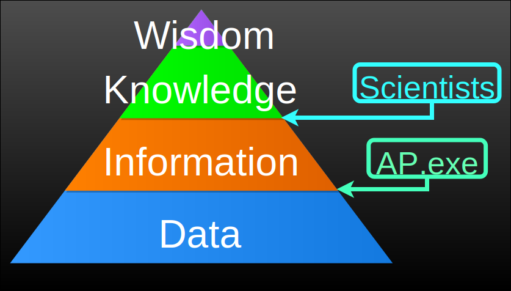

# Introduction to AnalysisPrograms.exe

AnalysisPrograms.exe (AP.exe) is a software package that analyses recordings
of the the environment. This tool is designed specifically to work with long
recordings that are collected by passive acoustic monitors.

The name, _AnalysisPrograms.exe_, is so general because we package a variety
of different analyses in one program. AP.exe can generate acoustic indices,
visualise indices, run event recognisers, and more!

AP.exe is over 10 years old, has more than 200K lines of code, and has done a lot
of analysis on audio data. We estimate we've analysed over 100 years of audio
data, totalling more than 200TB of files. 

## Philosophy

### One recording, one analysis
AP.exe works on one recording at a time. This is a good choice for us because it
means we do not have to write code or make assumptions on how or where your
audio data is stored.

In reality you will want to process many files. Similarly, AP.exe very
specifically avoids batch processing of files because we don’t want to make
assumptions about how your data is stored or how it should be computed. This is
important in universities that use PBS (Portable Batch System) compute
clusters---assumptions in how data is processed greatly vary.
The solution to batch processing is to script AP.exe. You can script AP.exe with
any language you like.

### Longer recordings are better

The majority of the recordings we collect are long: from 30 minutes, to 2 hours
(our median), to ~6.78 hours (WAVE file limit at 22050Hz, 16-bit, stereo), to
24 hour recordings!

Analysing all the data at once is in efficient and requires powerful computers.
Thus AP.exe breaks up long recordings into smaller chunks---typically one minute
in duration---and results are extracted from each chunk.

AP.exe is very good at this and can even parallelise the processing of these
chunks to increase analysis speed.

### Constantly changing

AP.exe is a research product and as such changes nearly weekly. You can find new
releases in the releases tab on GitHub (see [installing](./installing.md)).

### We're in the data transformation business

The role of AP.exe is transform raw audio data into more useful information.
AP.exe will however never attempt to make ecological or scientific inferences.
The data produced will almost always need post-processing, whether that be by
scripted analysis or manual review.

## Caveats

### Focused and narrow
AP.exe is designed to do automated, unassisted, analysis of audio at massive
scales. It answers the questions we need answered.

It is not a product (like SongScope, Kaleidoscope, or SoundID) where you can
build or customize recognisers as an end user.

Neither is it a library (like Seewave, warbleR, monitorR) because you can't
pick and choose functions to stitch together to make something new.

### Made for machines
AP.exe is made for machines to use. It is not user friendly, and has no graphical
user interface. This limitation is an important and necessary constraint for
AP.exe as it forces the tool to remain focused. 

### No support
We also officially provide no support, guarantee, or warranty for AP.exe. We
have released AP.exe so that the community may benefit from our work but we do
not have the resources to treat AP.exe as a fully fledged product.

Having said that, we're usually interested in fixing bugs, helping people, or
adding features---so please contact us!

### Old code, research code

Because of the age of the code, there are many bugs, a lot of old or unmaintained
code, and a rich, complex, history of changes. There be dragons.

